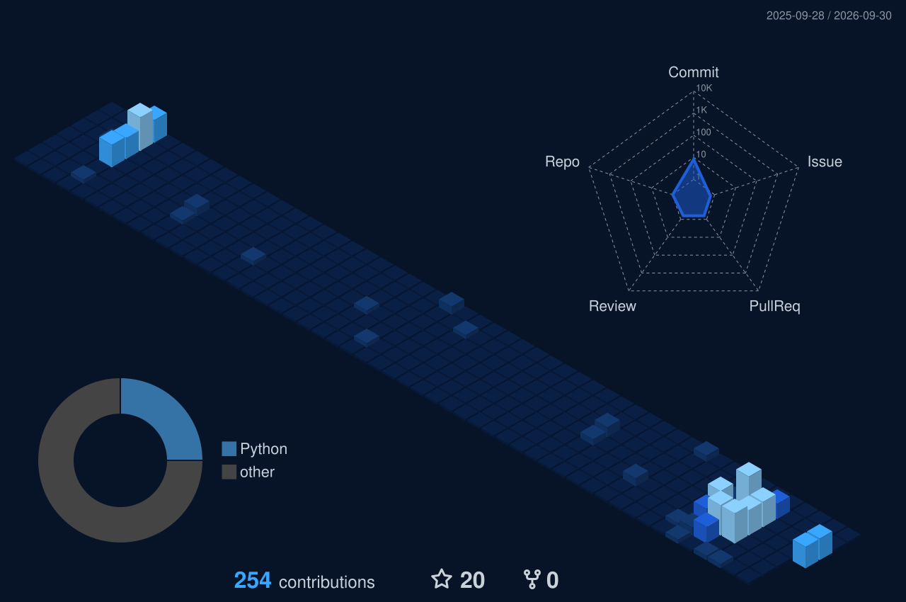

<!--
  java-heapler/java-heapler  ·  Profile README
  Design language adapted from ml-lubich's profile:
  navy/blue palette (labelColor #071428, base #0A1F44, accents #1E5FD9 / #39A7FF),
  centered layout, for-the-badge shields, capsule-render hero/footer.
  GitHub stats served from self-hosted instance so PRIVATE commits are counted.
-->

  

  

  
  
  
  

### About

I'm **Joe** — an AI engineer who ships **production agentic systems, RAG pipelines, and evaluation infrastructure** that automate mission-critical operations and pay for themselves. UC Berkeley Data Science & Cognitive Science.

| | |
|---|---|
| **Currently** | AI Engineer @ **Brio Water Technology** — building agentic support + forecasting systems |
| **Building** | Tool-calling agents · grounded RAG with guardrails · eval-driven LLM pipelines |
| **Ask me about** | RAG & retrieval quality · multi-agent orchestration · evals/guardrails · time-series forecasting · dbt data layers |
| **Toolbelt** | Python · FastAPI · Next.js · ChromaDB · GraphRAG · LangFuse · dbt · XGBoost |
| **Reach me** | [jheupler@berkeley.edu](mailto:jheupler@berkeley.edu) · [josephheupler.com](https://josephheupler.com) · [LinkedIn](https://www.linkedin.com/in/joseph-heupler) |

### Impact

  
  

  
  

- **Brio-bot** — enterprise RAG support assistant (FastAPI · Next.js · ChromaDB · GraphRAG · LLM tool-calling, SSE-streamed) with strict source citation, read-only tools, and human-in-the-loop review.
- **Briopedia** — git-backed knowledge base with CI/CD import checks, LangFuse evals, and golden regression datasets to block hallucinations before they reach the vector store.
- **Forecasting & diagnostics** — SARIMAX + XGBoost revenue models over 2 years of history; defect analytics separating user error from true failures; governed **dbt** layer across Salesforce, Sage 100, Shopify & Gorgias.

### Tech Stack

**Languages**

  
  
  
  

**AI / LLM & Agents**

  
  
  
  
  

**Backend & Web**

  
  
  
  
  

**Data & ML**

  
  
  
  
  
  

**Infra & Tooling**

  
  
  
  
  
  

### Featured Projects

| Project | What it does | Stack |
|---|---|---|
| [proactive-maintenance-predictor](https://github.com/java-heapler/proactive-maintenance-predictor) | Pre-failure equipment detection from time-series telemetry | XGBoost · SARIMAX |
| [smart-sales-predictor](https://github.com/java-heapler/smart-sales-predictor) | Revenue forecasting that cut forecast error ~20% | pandas · ARIMA · Prophet |
| [nn-digit-classification](https://github.com/java-heapler/nn-digit-classification) | MNIST neural net built from scratch (98%+ accuracy) | NumPy · backprop |
| [customer-insight-clustering](https://github.com/java-heapler/customer-insight-clustering) | Customer segmentation & cluster visualization | K-Means · seaborn |
| [gitlet](https://github.com/java-heapler/gitlet) | A Git-inspired VCS — commit graphs, SHA-1 objects, branching/merging | Java |
| [social-buzz-analyzer](https://github.com/java-heapler/social-buzz-analyzer) | NLP sentiment & engagement analysis | Python · NLP |

### GitHub Stats

<!-- Served from a self-hosted github-readme-stats instance so PRIVATE commits are counted. -->

  
  

  

  

### Contribution Graph

  

**What these towers mean**

- **Tall** weeks = shipping agents & RAG pipelines
- **Flat** stretches = deep-research / eval-tuning weeks
- **Spiky** weekends = side projects → [josephheupler.com](https://josephheupler.com)

### Let's Build Something

Production agentic AI, RAG with real guardrails, or forecasting systems that move the P&L — if that's you, [email me](mailto:jheupler@berkeley.edu), visit [josephheupler.com](https://josephheupler.com), or connect on [LinkedIn](https://www.linkedin.com/in/joseph-heupler).

  

